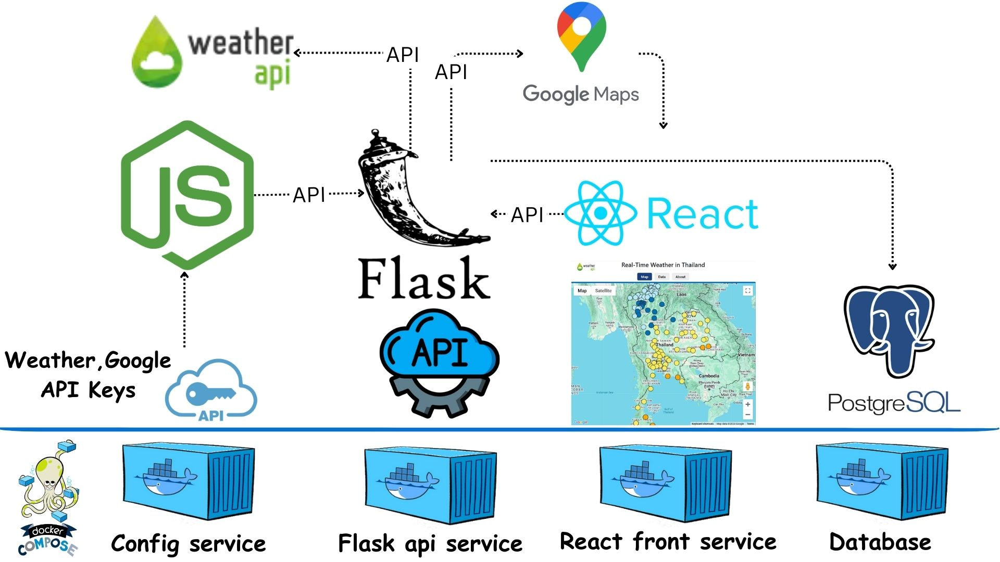

การทำงานของโปรแกรม Real-Time Weather in Thailand ประกอบด้วย 4 container จะมีการทำงานร่วมกันระหว่างบริการต่าง ๆ ผ่าน Docker โดยแต่ละ service จะมีหน้าที่และความรับผิดชอบที่ชัดเจน ดังนี้:

1. config-service (Node.js)
หน้าที่: ให้บริการ API ที่เก็บข้อมูลสำคัญ เช่น Google API Keys เพื่อความปลอดภัย
วิธีการทำงาน: เมื่อ flask-api-service ต้องการข้อมูลเช่น API Key เพื่อเชื่อมต่อกับ external API (เช่น API สำหรับดึงข้อมูลสภาพอากาศ), จะส่ง request ไปยัง config-service เพื่อดึงข้อมูลเหล่านั้น
ข้อความ: ประมาณการรักษาความปลอดภัยโดยการไม่เปิดเผย API Key ภายใน Flask API หรือ React
2. flask-api-service
หน้าที่: ให้บริการ API สำหรับให้ข้อมูลสภาพอากาศแบบ real-time โดยดึงข้อมูลจากแหล่งข้อมูลภายนอก (เช่น API สภาพอากาศ) และบันทึกข้อมูลลงใน PostgreSQL
วิธีการทำงาน:
ดึงข้อมูลสภาพอากาศจากแหล่งข้อมูลภายนอก โดยใช้ API Key ที่ได้จาก config-service
หลังจากนั้น, บันทึกข้อมูลสภาพอากาศ (เช่น อุณหภูมิ, ความชื้น, สถานะอากาศ) ลงใน PostgreSQL
Flask API จะมี endpoint สำหรับการดึงข้อมูลสภาพอากาศที่เก็บไว้ในฐานข้อมูล PostgreSQL
ส่งข้อมูลที่ดึงมาให้ React ผ่าน API ที่กำหนดไว้
3. react-front-app
หน้าที่: ส่วนของ UI ที่ให้ผู้ใช้สามารถดูข้อมูลสภาพอากาศในรูปแบบที่เข้าใจง่าย
วิธีการทำงาน:
React จะส่ง request ไปยัง flask-api-service เพื่อดึงข้อมูลสภาพอากาศที่เก็บไว้ใน PostgreSQL
เมื่อได้รับข้อมูลจาก API, React จะแสดงข้อมูลสภาพอากาศให้กับผู้ใช้ผ่านส่วนติดต่อที่ออกแบบไว้
React อาจจะใช้การแสดงข้อมูลแบบ real-time หรือแบบ refresh อัตโนมัติตามความต้องการ
4. PostgreSQL
หน้าที่: จัดเก็บข้อมูลสภาพอากาศที่ได้จาก API
วิธีการทำงาน:
ข้อมูลที่ได้จาก flask-api-service (เช่น ข้อมูลสภาพอากาศในเวลาจริง) จะถูกบันทึกลงใน PostgreSQL
PostgreSQL จะใช้สำหรับจัดเก็บข้อมูลในรูปแบบที่สามารถ query ได้อย่างมีประสิทธิภาพ

พัฒนาโดย นายณัชพล เกิดชนะ นักศึกษาระดับปริญญาโท สาขาวิศวกรรมคอมพิวเตอร์
ที่ปรึกษา ผู้ช่วยศาสตราจารย์ ดร. ชัยพร เขมะภาตะพันธ์
คณบดี วิทยาลัยวิศวกรรมศาสตร์และเทคโนโลยี (CITE) และผู้อำนวยการหลักสูตรสาขาวิชาวิศวกรรมคอมพิวเตอร์
มหาวิทยาลัยธุรกิจบัณฑิต