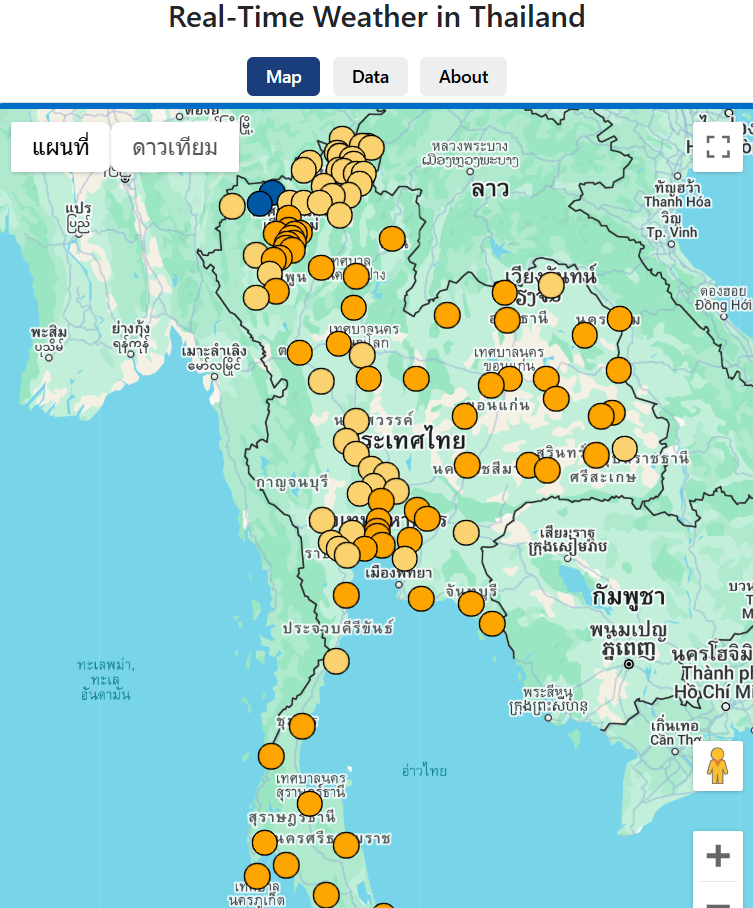

โปรแกรม Real-Time Weather in Thailand 

วัตถุประสงค์
โปรแกรมนี้ถูกพัฒนาขึ้นเพื่อให้ผู้ใช้สามารถเข้าถึงข้อมูลสภาพอากาศแบบเรียลไทม์ได้อย่างสะดวกและรวดเร็ว โดยมีการเก็บข้อมูลสภาพอากาศลงในฐานข้อมูล PostgreSQL เพื่อการวิเคราะห์ข้อมูลระยะยาว ทั้งยังสามารถเพิ่มข้อมูลระดับอำเภอ และขยายไปยังประเทศอื่น ๆ ได้ตามความต้องการของผู้ใช้งาน ทำให้ข้อมูลมีความยืดหยุ่นและครอบคลุมมากยิ่งขึ้น

คุณสมบัติที่สำคัญ
ดึงข้อมูลสภาพอากาศจาก API แบบเรียลไทม์
รองรับการบันทึกข้อมูลลงใน PostgreSQL เพื่อการใช้งานในระยะยาว
สามารถนำไปพัฒนาเพิ่มข้อมูล อำเภอและประเทศใหม่ๆ ได้ตามต้องการ
แสดงข้อมูลสำคัญ เช่น อุณหภูมิ, ความชื้น, ความเร็วลม, ความปกคลุมของเมฆ, ค่ารังสี UV, และ PM2.5

วิธีการทำงาน
โปรแกรมนี้เรียกใช้ข้อมูลสภาพอากาศจาก WeatherAPI ซึ่งเป็น API ที่น่าเชื่อถือและอัปเดตข้อมูลสภาพอากาศแบบเรียลไทม์ โดยทุกครั้งที่มีการร้องขอข้อมูล โปรแกรมจะเชื่อมต่อกับ WeatherAPI เพื่อดึงข้อมูลล่าสุดและจัดเก็บลงในฐานข้อมูล PostgreSQL เพื่อให้สามารถเก็บข้อมูลย้อนหลังและนำมาวิเคราะห์ได้ ทั้งยังแสดงผลข้อมูลในหน้าแอปพลิเคชันในรูปแบบที่สวยงามและอ่านง่าย นอกจากนี้ โปรแกรมยังรองรับการเพิ่มข้อมูลสภาพอากาศของอำเภอและประเทศต่าง ๆ ได้ตามความต้องการของผู้ใช้

เทคโนโลยีที่ใช้
โปรแกรมนี้พัฒนาขึ้นโดยใช้เทคโนโลยี Node.js และ React ซึ่งช่วยในการสร้างอินเทอร์เฟซที่มีความทันสมัยและใช้งานได้ง่าย ข้อมูลทั้งหมดถูกจัดเก็บใน PostgreSQL ที่มีประสิทธิภาพสูงในการจัดการข้อมูล โดยสามารถเข้าถึงและวิเคราะห์ข้อมูลย้อนหลังได้อย่างมีประสิทธิภาพ ทำให้สามารถนำข้อมูลสภาพอากาศที่เก็บไว้ไปใช้ในการสร้างรายงานหรือการวิเคราะห์เชิงลึกตามความต้องการของผู้ใช้ได้อย่างหลากหลาย

นอกจากนี้โปรแกรมยังมีการใช้ API ที่ช่วยให้สามารถดึงข้อมูลสภาพอากาศจากแหล่งต่างๆ ได้อย่างแม่นยำและทันเวลา พร้อมทั้งรองรับการทำงานแบบเรียลไทม์ ด้วยการเชื่อมต่อกับ Weather API และ Google Maps API เพื่อเพิ่มความสะดวกในการแสดงผลข้อมูลและการวิเคราะห์เชิงลึก

โครงสร้างระบบงานประกอบด้วย 4 container จะมีการทำงานร่วมกันระหว่างบริการต่าง ๆ ผ่าน Docker โดยแต่ละ service จะมีหน้าที่และความรับผิดชอบที่ชัดเจน ดังนี้:

1. config-service (Node.js)
หน้าที่: ให้บริการ API ที่เก็บข้อมูลสำคัญ เช่น Google API Keys เพื่อความปลอดภัย
วิธีการทำงาน: เมื่อ flask-api-service ต้องการข้อมูลเช่น API Key เพื่อเชื่อมต่อกับ external API (เช่น API สำหรับดึงข้อมูลสภาพอากาศ), จะส่ง request ไปยัง config-service เพื่อดึงข้อมูลเหล่านั้น
ข้อความ: ประมาณการรักษาความปลอดภัยโดยการไม่เปิดเผย API Key ภายใน Flask API หรือ React

2. flask-api-service
หน้าที่: ให้บริการ API สำหรับให้ข้อมูลสภาพอากาศแบบ real-time โดยดึงข้อมูลจากแหล่งข้อมูลภายนอก (เช่น API สภาพอากาศ) และบันทึกข้อมูลลงใน PostgreSQL
วิธีการทำงาน:
ดึงข้อมูลสภาพอากาศจากแหล่งข้อมูลภายนอก โดยใช้ API Key ที่ได้จาก config-service
หลังจากนั้น, บันทึกข้อมูลสภาพอากาศ (เช่น อุณหภูมิ, ความชื้น, สถานะอากาศ) ลงใน PostgreSQL
Flask API จะมี endpoint สำหรับการดึงข้อมูลสภาพอากาศที่เก็บไว้ในฐานข้อมูล PostgreSQL
ส่งข้อมูลที่ดึงมาให้ React ผ่าน API ที่กำหนดไว้

3. react-front-app
หน้าที่: ส่วนของ UI ที่ให้ผู้ใช้สามารถดูข้อมูลสภาพอากาศในรูปแบบที่เข้าใจง่าย
วิธีการทำงาน:
React จะส่ง request ไปยัง flask-api-service เพื่อดึงข้อมูลสภาพอากาศที่เก็บไว้ใน PostgreSQL
เมื่อได้รับข้อมูลจาก API, React จะแสดงข้อมูลสภาพอากาศให้กับผู้ใช้ผ่านส่วนติดต่อที่ออกแบบไว้
React อาจจะใช้การแสดงข้อมูลแบบ real-time หรือแบบ refresh อัตโนมัติตามความต้องการ

4. PostgreSQL
หน้าที่: จัดเก็บข้อมูลสภาพอากาศที่ได้จาก API
วิธีการทำงาน:
ข้อมูลที่ได้จาก flask-api-service (เช่น ข้อมูลสภาพอากาศในเวลาจริง) จะตรวจสอบกับข้อมูลล่าสุดในฐานข้อมูลทุก 3 นาที ถ้าเป็นข้อมูลใหม่จะถูกบันทึกลงใน PostgreSQL เพื่อใช้วิเคราะห์ข้อมูลต่อไป

โครงสร้างระบบงาน

วิธีติดตั้ง:
ใช้ Docker Compose ติดตั้ง 4 Container ดังนี้
- config-service: เก็บ API KEY 
- flask-api-service: ให้บริการ API ของทั้งระบบ
- react-front-app: Application
- db: ฐานข้อมูล PostgreSQL

พิมพ์คำสั่ง docker-compose build
ระบบจะทำการ ติดตั้ง Dockerfiles ของแต่ละ container ให้อัตโนมัติ

พิกัดจังหวัด/อำเภอ และระดับสีอุณหภูมิ

InfoWindowข้อมูลสภาพอากาศ

รายละเอียดสภาพอากาศ

ขั้นตอนการสมัครขอใช้ Google APIKEY

พัฒนาโดย  
    นายณัชพล เกิดชนะ นักศึกษาระดับปริญญาโท สาขาวิศวกรรมคอมพิวเตอร์  

อาจารย์ที่ปรึกษา  
    ผู้ช่วยศาสตราจารย์ ดร. ชัยพร เขมะภาตะพันธ์  
    คณบดี วิทยาลัยวิศวกรรมศาสตร์และเทคโนโลยี (CITE) และผู้อำนวยการหลักสูตรสาขาวิชาวิศวกรรมคอมพิวเตอร์  
    มหาวิทยาลัยธุรกิจบัณฑิต